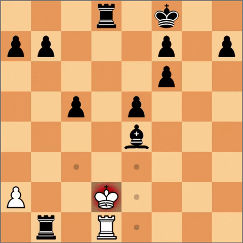

<h1 align="center">Chess in JS</h1>

## Description

Chess implemented from scratch in js. In this game you can test your chess skills. You will have to play against a complex algorithm and you will have to use all your skills to defeat it. In our code all possible variations of moves are implemented, from the usual pawn move to castling and en passant.

## How to play

### Make a move

 * To make a move, click on a piece and select the position to which you want to move this piece.

### To capture piece

 * To capture someone else's piece, click on your piece, then click on the piece you want to capture, it will be highlighted.

### More complex moves

 * Нou can also make more difficult moves, for example castling or en passant. Above you can see how it works

## Participants: 
* Nikita Gryshak - https://github.com/holdennekt
* Bohdan Pinchuk - https://github.com/BogPin
