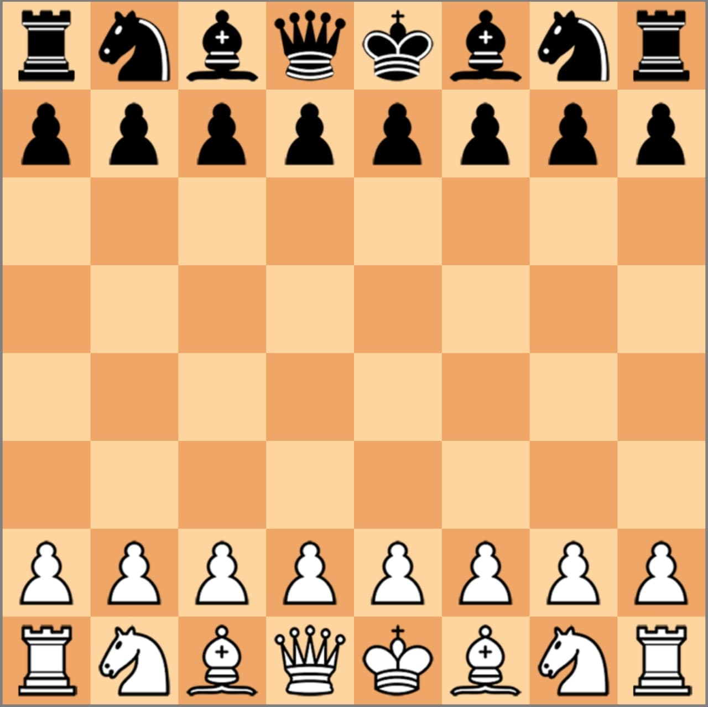

<h1 align="center">Chess in JS</h1>

## Description

Chess implemented from scratch in js. In this game you can test your chess skills. You will have to play against a complex algorithm and you will have to use all your skills to defeat it. In our code all possible variations of moves are implemented, from the usual pawn move to castling and en passant.

## How to play

## Participants: 
* Nikita Gryshak - https://github.com/holdennekt
* Bohdan Pinchuk - https://github.com/BogPin
