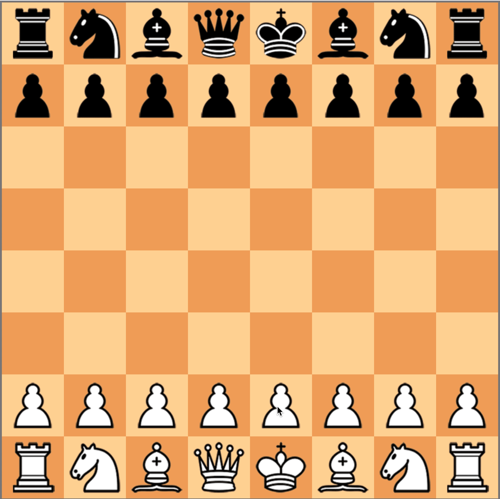

<h1 align="center">Chess in JS</h1>

<p align="center">
</p>

## Description

Chess implemented from scratch in js. In this game you can test your chess skills. You will have to play against a complex algorithm and you will have to use all your skills to defeat it. In our code all possible variations of moves are implemented, from the usual pawn move to castling and en passant.

## Installation

1. Clone the repository:
```bash
$ git clone https://github.com/holdennekt/chess_kursach
```
2. Open folder:
```bash
$ cd chess_kursach/src
```
3. Run the program:
```bash
$ google-chrome --new-tab index.html
```

## How to play

### Make a move

<p align="center">
</p>

 * To make a move, click on a piece and click on the suggested square.

### To capture piece

<p align="center">
</p>

 * To capture someone else's piece, click on your piece, then click on the piece you want to capture, it will be highlighted.

### More complex moves

<p align="center">


</p>

 * You can also make more difficult moves, for example castling or en passant. Above you can see how it works

### Pawn promotion

<p align="center">
</p>

 * When you reach the last square with a pawn, you can promote your pawn to any piece from list.

### Mate

<p align="center">
</p>

 * When one side mates, you can start new game.


## Participants: 
* Nikita Gryshak - https://github.com/holdennekt
* Bohdan Pinchuk - https://github.com/BogPin

## License
This program is distributed under an [MIT License](https://github.com/holdennekt/chess_kursach/blob/main/LICENSE).


